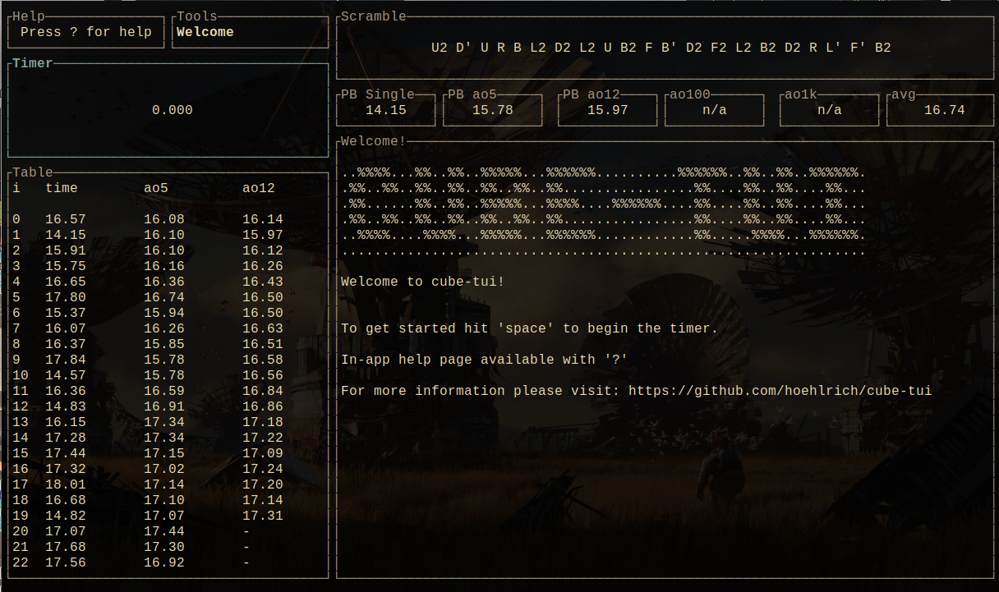

# Cube TUI

A pure-rust terminal user-interface for speedcubing

## Installation

Install rust if not already: https://www.rust-lang.org/tools/install

Clone the repo
`git clone https://github.com/hoehlrich/cube-tui`

Build it
`cd cube-tui && cargo install --path .`

## Features

### What it does

1. Time's your solves
2. Generates stats for your solves
3. Generates a random scramble
4. Runs lightweight, in the terminal, and with pure rust

### What it will do

1. Graph solves
2. More tools (scramble display, stats, solver)
3. Multi-stage solves
4. Manage sessions for different cubes
5. Generate a scramble correctly (instead of random turns)

### What it doesn't do

1. Stackmat-esque timer (not possible in ANSI terminal)
2. Integration with a db
